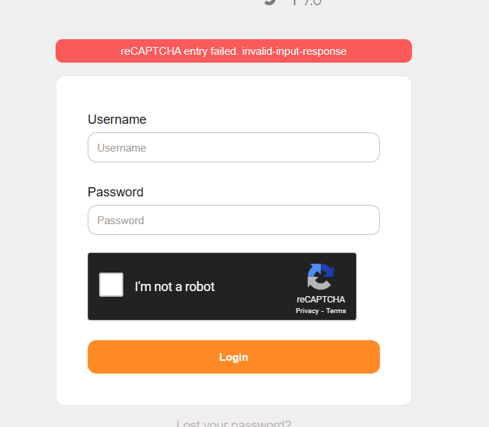

# OTRS-Google-Captcha-for-Login-Form
- Google reCaptcha at Znuny agent and customer portal (login form)		
- Modification files (based on Znuny 7.0.9) has been tag with :

	For Agent Portal  
	
			# --
			# Agent Google Captcha
			# -- 
			CODE  
			# -- 
	
	For Customer Portal  
		
			# --
			# Customer Google Captcha
			# -- 
			CODE  
			# --
			
- Instructions:  
	
			1. create and configure captcha V2 https://www.google.com/recaptcha/admin  
			2. Install Captcha::reCAPTCHA::V2 via cpan  
			3. Enable Captcha for Agent and Customer at Admin > System Configuration > Frontend::Output::FilterElementPost###ShowGoogleCaptcha  
			
				Login = > 1
				CustomerLogin => 1
				
			*To disable it back, set as 0.
			
			5. Update Site Key at Admin > System Configuration > GoogleCaptcha::SiteKey  
			6. Update Secret Key at Admin > System Configuration > GoogleCaptcha::SecretKey 
			
		

Simulation: Login without completing captcha    

 

